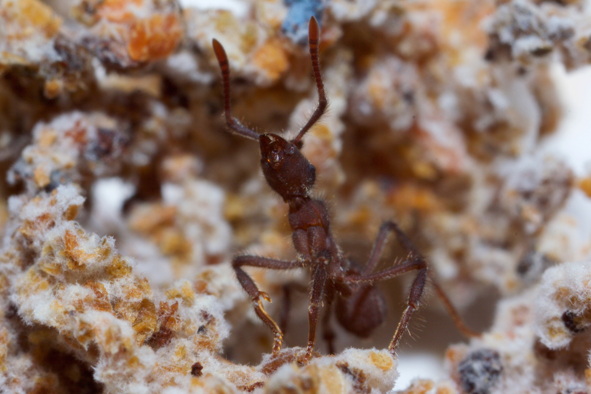

I am a second year graduate student in the [Microbiology Doctoral Training Program](https://microbiology.wisc.edu/) at the University of Wisconsin-Madison. I work in the [Currie lab](https://currielab.wisc.edu/) studying insect-microbe associations. 

