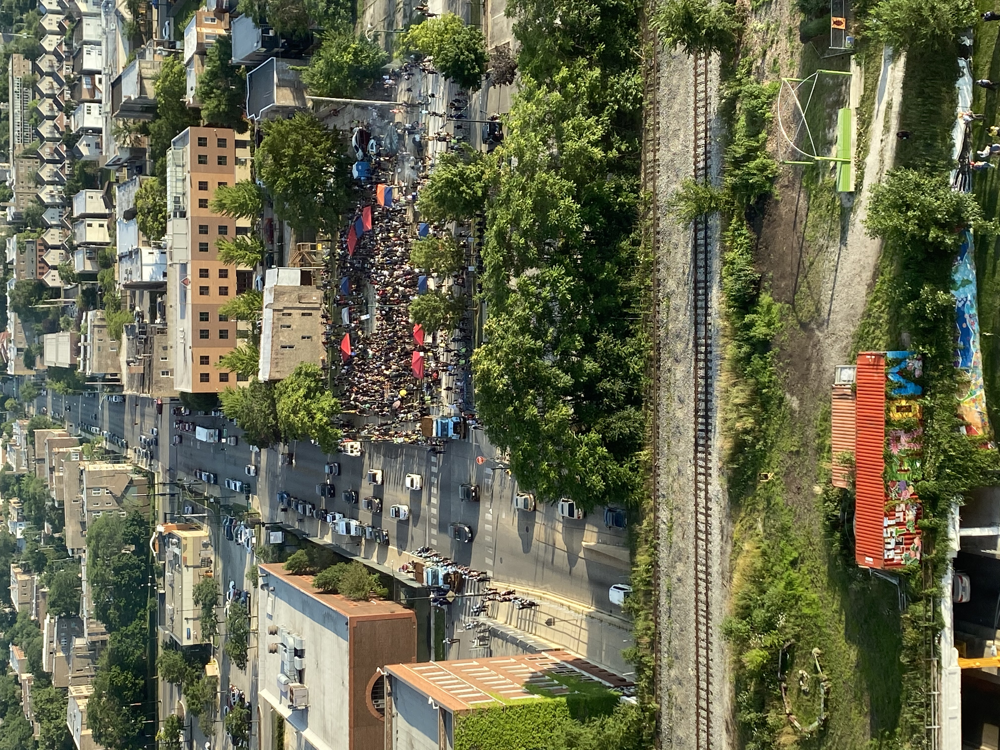

I am a PhD candidate in the [Political Science Doctoral Program](political-science.uchicago.edu/) at the University of Chicago. I study race in American politics, social movements, Black feminism, and carceral studies. 

Through community-engaged scholarship, my research investigates how radical movement organizers translate world-making ambitions into grassroots pathways for political change. My dissertation project, *Carceral Racial Capitalism and the Radical Politics of Abolitionist Organizing in Post-Industrial Chicago,* maps the lineages, emergence, and specific ideological and strategic interventions of the contemporary abolitionist movement ecosystem in Chicago through interviews, archival work, media analysis, and participant observation. I am informed by Black feminist methods, interpretive approaches, and a relational ethic. I am also conversant in quantitative methods and have a background in survey research. Most importantly, my scholarship prioritizes deep relationship and trust-building with the communities I research, which improves both the ethical and empirical grounding of my work. 

I currently hold a Joint Dissertation Completion Fellowship with the University of Chicago’s Center for the Study of Race, Politics, and Culture and the Center for the Study of Gender and Sexuality. My work has also been supported by the Pozen Center for Human Rights and the American Political Science Association. My research has been published in journals including *Theory, Research, and Action in Urban Education* and the *European Journal of Social Psychology*. 

*View from Nichols Tower of Homan Square/Freedom Square, Chicago, 7/24/2020. A large group of people gather in an empty lot, among colorful pop-up canopies to commemorate the 5 year anniversary of the Freedom Square occupation protesting the Homan Square Black Site administered by Chicago Police (CPD.) Across the street, a line of 30+ CPD officers, stand in front of the Homan Square CPD building. In the foreground, a shipping container repurposed as community art piece reads "Let Love Grow." Photo taken by author.*
